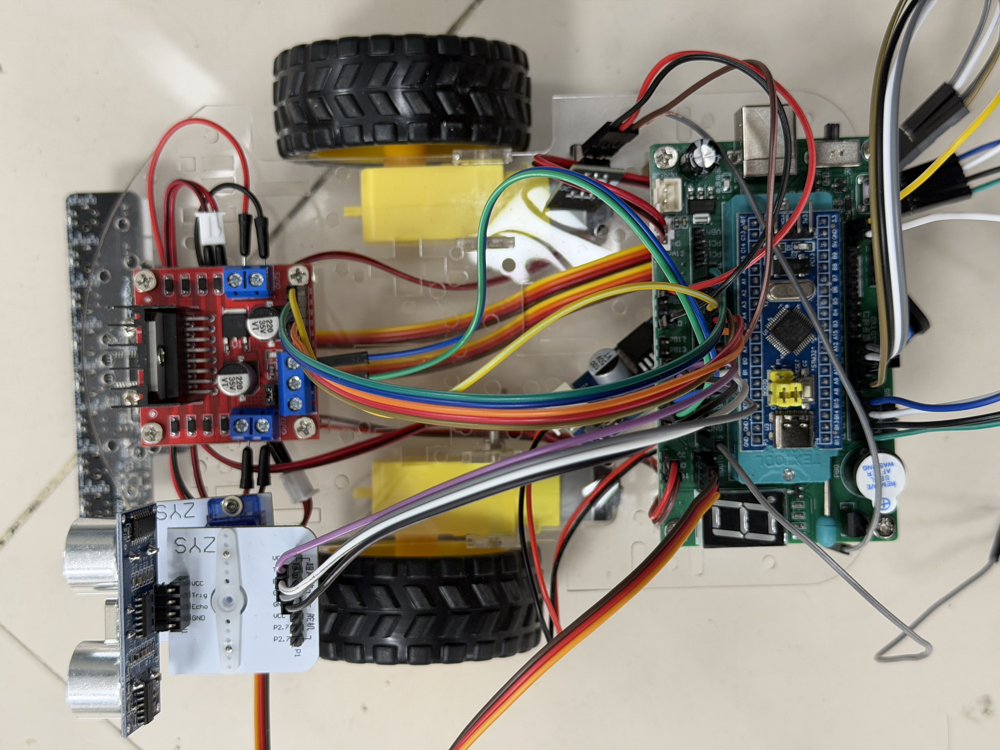

# FreeRTOS 智能循迹小车

基于 **STM32F103C8T6 + FreeRTOS** 的多模式智能小车，支持红外循迹、遥控驾驶、超声波避障和低功耗待机，通过 NEC 红外遥控实时切换模式。

> 📌 本项目为个人独立完成的嵌入式实战项目，涵盖 RTOS 多任务调度、PID 控制、硬件协议解析、低功耗设计等核心技术。

---

## 演示

### 🎬 视频演示

<div align="center">
  <table>
    <tr>
    <td colspan="2" align="center">
        <video src="
https://github.com/user-attachments/assets/5674fc4e-0a40-4727-a7a3-d156e0676dcb" width="800" controls></video>
      </td>
    <td colspan="2" align="center">
        <video src="https://github.com/user-attachments/assets/7707b180-8400-42cd-bd99-8556921a5819" width="800" controls></video>
      </td>
      <td align="center">
        <br><b>实物图</b>
      </td>
    </tr>
  </table>
</div>

**循迹模式演示**


**避障/遥控模式演示**


### 📷 实物图

<!-- 将图片文件放入项目后替换下方路径 -->


---

## 硬件平台

| 组件 | 型号/参数 |
|------|-----------|
| 主控 MCU | STM32F103C8T6 (Cortex-M3, 72MHz, 64KB Flash, 20KB SRAM) |
| 电机驱动 | L298N H桥，双路 PWM 调速（TIM2 CH3/CH4，1kHz） |
| 循迹传感器 | 8路红外对管阵列（PA9-PA12 + PB12-PB15） |
| 测距传感器 | HC-SR04 超声波模块（TIM4 计时） |
| 遥控接收 | VS1838B 红外接收头（TIM3 输入捕获，NEC 协议） |
| 电源管理 | RTC 闹钟唤醒待机 / EXTI 中断唤醒停止模式 |

---

## 功能与模式

通过红外遥控器按键切换四种工作模式：

| 按键 | 模式 | 说明 |
|:----:|------|------|
| `*` | 循迹模式 | 8路红外传感器 + PD 控制算法自动沿黑线行驶 |
| `#` | 遥控模式 | 红外遥控器实时控制前进/后退/转向/自旋 |
| `0` | 避障模式 | 超声波实时测距，障碍物 <10cm 自动刹车 |
| `O` | 省电模式 | 进入 MCU 低功耗状态，支持 RTC/按键唤醒 |

---

## 系统架构

```
┌──────────────────────────────────────────────────┐
│              Application Layer                    │
│  ┌─────────┐  ┌──────────┐  ┌─────────────────┐ │
│  │循迹任务  │  │遥控任务   │  │避障任务          │ │
│  │50ms 周期 │  │50ms 周期  │  │50ms 周期        │ │
│  └────┬─────┘  └────┬─────┘  └───────┬─────────┘ │
│       │              │          xQueue│(距离数据)  │
│  ┌────┴──────────────┴────────────────┴─────────┐ │
│  │         模式选择任务 (20ms 周期)               │ │
│  │     动态创建/销毁模式任务 · IR按键解析          │ │
│  └──────────────────────────────────────────────┘ │
├──────────────────────────────────────────────────┤
│              Control Layer                        │
│  ┌──────────────┐          ┌───────────────────┐ │
│  │ PID 控制器    │          │ 低功耗管理         │ │
│  │ Kp=60 Kd=30  │          │ Standby / Stop    │ │
│  └──────────────┘          └───────────────────┘ │
├──────────────────────────────────────────────────┤
│              BSP Layer (硬件抽象)                  │
│  电机驱动 │ PWM控制 │ 红外传感器 │ 超声波 │ IR遥控  │
├──────────────────────────────────────────────────┤
│              STM32 HAL + FreeRTOS Kernel          │
└──────────────────────────────────────────────────┘
```

---

## 技术亮点

### 1. FreeRTOS 动态任务管理

模式切换时**运行时创建/销毁**任务，而非让所有任务常驻，节省 SRAM（仅 20KB）：

```c
// 按下 '*' 切换循迹模式
TrackMode = TrackMode ^ 1;
if (TrackMode) {
    DeleteTask(&remoteTaskHandle);  // 先销毁互斥模式
    xTaskCreate(vTrackMode, "vTrackMode", 400, NULL, 5, &trackTaskHandle);
} else {
    DeleteTask(&trackTaskHandle);
    Car_Stop();
}
```

- 任务句柄 NULL 检查防止重复创建和野指针删除
- `osDelayUntil()` 替代 `osDelay()` 保证周期确定性，消除任务执行时间导致的抖动
- `xQueueOverwrite()` 传递超声波距离数据，保证避障任务与循迹任务间始终读到最新值

### 2. PD 循迹控制算法

8路传感器打包为 8-bit 位图，左右各 4 路对称比较确定偏差方向和幅度：

```
传感器布局:  [PB15 PB14 PB13 PB12 | PA9 PA10 PA11 PA12]
              ← 右侧 4路 →          ← 左侧 4路 →

偏差 → PID → 差速转向:
  左偏: Car_SetSpeed(BASE + pid, BASE - pid)
  右偏: Car_SetSpeed(BASE - pid, BASE + pid)
```

- **PD 控制**（Kp=60, Ki=0, Kd=30）：无积分项避免积分饱和，适合快速响应场景
- **丢线保护**：连续 10 次（500ms）全白读数后刹车，防止冲出赛道
- **静摩擦补偿**：停车后首次启动瞬间输出 100% PWM 克服静摩擦力

### 3. NEC 红外协议硬件解码

基于 TIM3 输入捕获 + 极性翻转实现全硬件辅助 NEC 协议解析：

```
NEC 帧结构: [9ms引导 + 4.5ms间隔] + [地址码 + 地址反码 + 数据码 + 数据反码]
逻辑 0: 560µs载波 + 560µs静默
逻辑 1: 560µs载波 + 1680µs静默
```

- 输入捕获记录每段脉冲宽度，`Time_Range()` 容差校验（±200µs）
- 地址码校验过滤非本遥控器信号，防止环境红外干扰误触发
- 17 键映射表支持完整控制

### 4. 低功耗设计

支持两种低功耗模式，覆盖不同唤醒需求：

| 模式 | 功耗级别 | 唤醒方式 | 恢复速度 |
|------|---------|---------|---------|
| Stop 模式 | 中 | PA8 按键 (EXTI) | 快（保留 SRAM） |
| Standby 模式 | 最低 | RTC 闹钟 | 慢（等同复位） |

Stop 模式恢复序列：刹车 → 停 PWM → 挂起 SysTick → 清中断标志 → 进入停止 → **唤醒后**重配时钟 → 恢复 SysTick → 清除 IR 状态 → 重启 PWM + 红外接收

---

## 项目结构

```
├── Application/
│   ├── Control/        # PID控制器、低功耗管理
│   └── Task/           # 循迹任务逻辑（传感器融合 + 方向决策）
├── Core/Src/
│   ├── main.c          # 系统初始化入口
│   ├── freertos.c      # FreeRTOS 任务定义与模式切换
│   ├── tim.c           # TIM2(PWM) / TIM3(IR捕获) / TIM4(超声波)
│   └── rtc.c           # RTC闹钟配置（低功耗唤醒）
├── Drivers/BSP/        # 板级支持包
│   ├── bsp_motor.c     # H桥电机驱动（双路差速）
│   ├── bsp_redCheck.c  # 8路红外传感器阵列读取
│   ├── bsp_ultraSound.c # HC-SR04 超声波测距
│   └── remote_ir.c     # NEC红外协议解码器
├── Middlewares/         # FreeRTOS 内核源码
└── MDK-ARM/            # Keil µVision 工程文件
```

---

## 开发环境

- **IDE:** Keil µVision MDK-ARM v5.32
- **代码生成:** STM32CubeMX v6.16.1
- **调试器:** ST-Link V2 (SWD)
- **RTOS:** FreeRTOS v10 (CMSIS-OS2 封装)

---

## 构建与烧录

1. 使用 Keil µVision 打开 `MDK-ARM/Track_Car.uvprojx`
2. 编译：`Project → Build Target` (F7)
3. 烧录：`Flash → Download` (F8)

如需修改引脚/外设配置，使用 STM32CubeMX 打开 `Track_Car.ioc`，生成代码后手动合并 `USER CODE` 区段。
